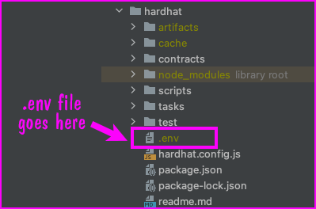
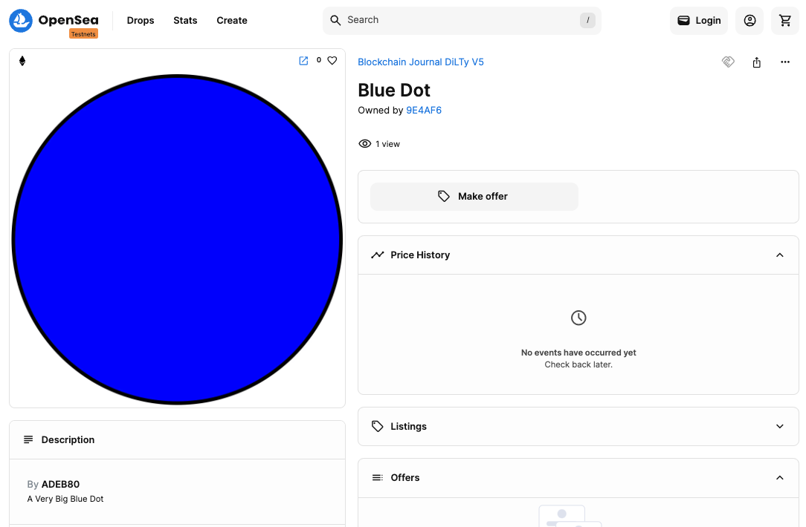

|For demonstration use only|
|---|
|Be advised that the code in this repository is intended for demonstration purposes only.  It is not intended for use in a production environment.  The code is provided as-is and the author is not responsible for any damages that may result from its use.  The code is provided under the MIT license.|

# Using HardHat to create and run the NFT minting contract

The purpose of this project is to demonstrate NFT creation, deployment and assignment to a user.

This project is written using the HardHat framework for Ethereum development. You'll use scripts that run under the HardHat framework to deploy the smart contract that manages NFT activity. You'll use a HardHat script to extract the [ABI](https://en.wikipedia.org/wiki/Application_binary_interface) that defines the smart contract's interface. Also, you'll use a Hardhat script to mint and transfer an NFT to a user defined by a particular Ethereum address.

In addition, you'll use a Hardhat task to upload IPFS the image used by all NFTs generated by way of the smart contract.

The order by which the tasks and scripts are run is as follows:

- `./tasks/diltyUploadPngToIpfsPinata.js`
- `./scripts/deploy-dilty.js`
- `./scripts/extract-dilty-abi.js`
- `./tasks/diltyMintAndTransferNft.js`

However, before you can run the tasks and scripts, you'll need a `.env` file in the root of this `hardhat` directory. The contents of the `.env`
file are described in the section titled "Setting up the `.env` file" below. Click [this link](#setting-up-the-env-file) to read the section in detail.


# Requirements

A computer running Node.JS 18+

# Set up

Clone the source code from GitHub:

```bash
git clone https://github.com/BlockchainJournal/Create-Tokengate-Demo.git
```

Navigate to the working directory of the demonstration project:

```bash
cd Create-Tokengate-Demo
```


Install the dependency libraries

```bash
npm install
```

# Setting up the `.env` file

YHou need to create and configure a `.env` file in the root of the `hardhat` directory.



The `.env` file contains the environment variables that are used by the scripts and tasks in the `hardhat` directory.

The configuration of the `.env` file is as follows:

```env
INFURA_API_KEY=<Infura key here> // used to access the Seoplia testnet
SEPOLIA_PRIVATE_KEY=<Sepolia private key here> // This is the private key of the account that will deploy the smart contract
ALCHEMY_API_KEY=<Alchemy key here> // used by HardHat as the provider to the Sepolia testnet
PINATA_API_KEY=<Pinata API key here>
PINATA_SECRET_API_KEY=<Pinata secret here>
```

# Compiling and deploying the smart contract to the testnet

Run the following command to compile and deploy the smart contract to the testnet:

```bash
CONTRACT_NAME=<CONTRACT_NAME> npx hardhat run scripts/deploy-dilty.js --network sepolia
```

Example:
```bash
CONTRACT_NAME=Dilty07 npx hardhat run scripts/deploy-dilty.js --network sepolia
```
You'll get output similar to the following: 

```text
Compiled 1 Solidity file successfully (evm target: paris).
Deploying contract with the contract name: Dilty07
Dilty address: 0xe2Da5E9FbC9EE01c866167558f9f521B2a09a236
Copying /Users/guest/Projects/Create-Tokengate-Demo/hardhat/scripts/data/dilty-addresses.json to /Users/guest/Projects/Create-Tokengate-Demo/website/src/data/dilty-addresses.json
```

The script will inspect the `./contracts` directory for any files with the `.sol` extension looking for a contract with a name that corresponds to the name defined by the environment variable, `CONTRACT_NAME`.

The contract name is defined in the `.sol` file as follows:

```solidity
contract Dilty07 is ERC721URIStorage, Ownable {
    uint256 private totalSupply = 0; //total number of tokens minted
    mapping(address => uint256) addressTokenIds;

    event Minting(string tokenURI, uint256 tokenId);
  .
  .
  .
}
```
In the case above the contract name is `Dilty07`.


# Extracting the ABI to a file

```bash
CONTRACT_NAME=<CONTRACT_NAME> npx hardhat run scripts/extract-dilty-abi.js --network sepolia
```

WHERE:

`<CONTRACT_NAME>` is the name of the contract you want to extract the ABI from.

Example:
```bash 
CONTRACT_NAME=Dilty07 npx hardhat run scripts/extract-dilty-abi.js --network sepolia
```

You'll get output similar to the following: 

```text
Copying /Users/guest/Projects/Create-Tokengate-Demo/hardhat/scripts/data/dilty-abi.json to /Users/guest/Projects/Create-Tokengate-Demo/website/src/data/dilty-abi.json
```


# Uploading an image to IPFS

Run the following command to upload an image to IPFS:

```bash
npx hardhat \
  diltyUploadPngToIpfsPinata \
  --asset-name "Big Pink Dot" \
  --asset-description "A Very Big Pink Dot" \
  --image-file-path "./tasks/images/pink-dot.png" \
  --show-stack-traces
```

WHERE
    
    `--asset-name` is the name of the asset you want to upload to IPFS.
    
    `--asset-description` is the description of the asset you want to upload to IPFS.
    
    `--image-file-path` is the path to the image file you want to upload to IPFS.

# Creating the NFT using the image uploaded to IPFS

From within the root of the `hardhat` directory, run the following command:

You see out put similar to the following:

```text
Writing to /Users/guest/Projects/Create-Tokengate-Demo/hardhat/scripts/data/dilty-ipfs.json the following {
  "imageCid": "QmZSiqGx94hsCNs2VCoYHvme21XgkoJak56XdfPFJKSzAy",
  "metadataCid": "QmY2jfUar36iDZEqrd3tbyrykN1Y7XWW69VcFiCxadbzWe"
}
Copying /Users/guest/Projects/Create-Tokengate-Demo/hardhat/scripts/data/dilty-ipfs.json to /Users/guest/Projects/Create-Tokengate-Demo/website/src/data/dilty-ipfs.json
```

You're output will be different according to the file system under which you are running the command.

You can view the image on IPFS by visiting the `ipfs.io` gateway using a URL that uses the value of JSON property `imageCid`.

For example, the following URL uses the `imageCid` value `QmZSiqGx94hsCNs2VCoYHvme21XgkoJak56XdfPFJKSzAy`:

```text
https://ipfs.io/ipfs/QmZSiqGx94hsCNs2VCoYHvme21XgkoJak56XdfPFJKSzAy
```

You'll use the `imageCid` value generated when you ran the `hardhat` task `diltyUploadPngToIpfsPinata` to create the NFT.

# Minting and transferring the NFT to a user

Run the following command to mint and transfer the NFT to a user:

```bash
RECIPIENT_ADDRESS=<RECIPIENT_ADDRESS> npx hardhat run scripts/mint-n-transfer-dilty.js --network sepolia
```

Replace `<RECIPIENT_ADDRESS>` with the Ethereum address of the recipient of the NFT for example `0x9e4aF6FDa84260f957Ff65E1EE447E522C5E0e271`

For example:

```bash
RECIPIENT_ADDRESS=0x9e4aF6FDa84260f957Ff65E1EE447E522C5E0e27 npx hardhat run scripts/mint-n-transfer-dilty.js --network sepolia
```

You see output similar to the following:

```text
contractAddress: 0xe2Da5E9FbC9EE01c866167558f9f521B2a09a236
Contract Name: Blockchain Journal DiLTy V5
Minting NFT...
newTokenId: 2
Transferring token to as ID : 2
Result: {
  "txHash": "0x8466f9f20ef93c40902b3c0c3ea03d477dcf4c9c6ec58b19ebd6f54c8a03d6a9",
  "tokenId": 2,
  "recipientAddress": "0x9e4aF6FDa84260f957Ff65E1EE447E522C5E0e27",
  "tokenUri": "ipfs://QmNjCU8jtB8wtm2ywFoXkiPifKh2sDT1GBZKTQTGGvTdLg",
  "contractAddress": "0xe2Da5E9FbC9EE01c866167558f9f521B2a09a236"
}
```
# Viewing the NFT on OpenSea TestNet

After you've waited a few minutes for the transaction to make it through the Ethereum network (yes, waiting is really important!), you can view the NFT on OpenSea TestNet.

You can view the NFT on the OpenSea TestNet by visiting the following URL in a browser:

```text
https://testnets.opensea.io/assets/sepolia/<RECIPIENT_ADDRESS>/<TOKEN_ID>
```

WHERE

    `<CONTRACT_ADDRESS>` is the Ethereum address of the contract managing the NFT as shown in JSON property `contractAddress` displaeyed in output printed in the terminal.
    
    `<TOKEN_ID>` is the `tokenid` returned in the result output printed in the terminal.

For example, the following URL uses the `CONTRACT_ADDRESS` value `0xe2Da5E9FbC9EE01c866167558f9f521B2a09a236` and the `TOKEN_ID` value `2

```text
https://testnets.opensea.io/assets/sepolia/0xe2da5e9fbc9ee01c866167558f9f521b2a09a236/2
```




