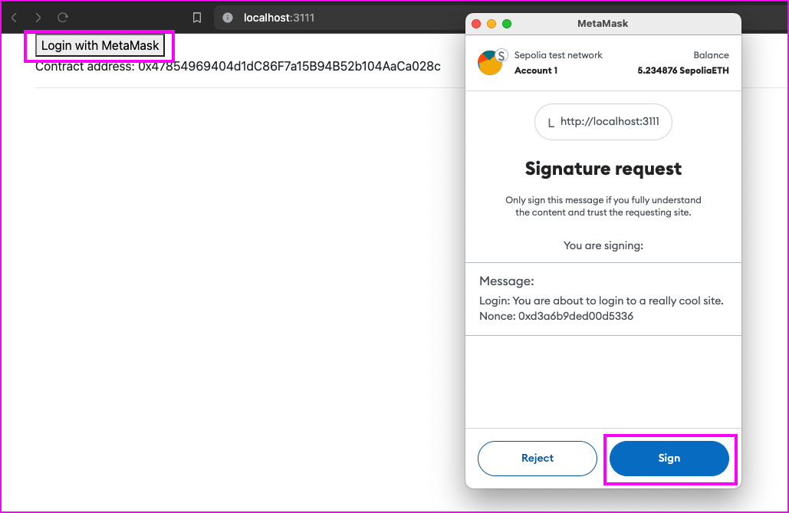
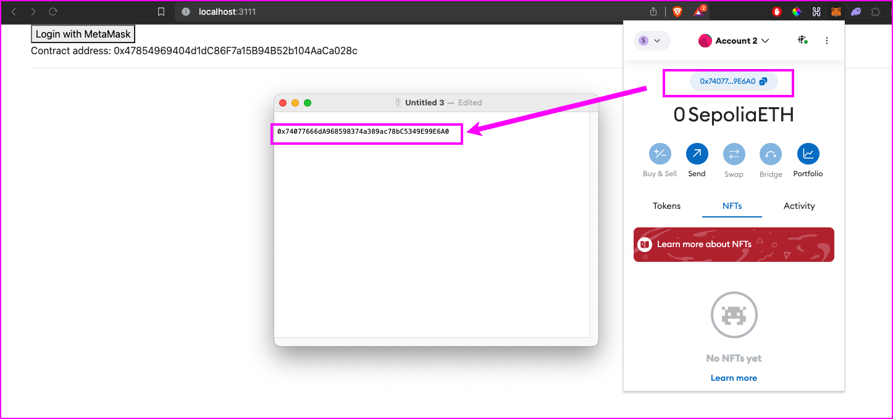
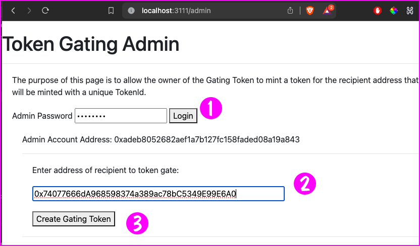
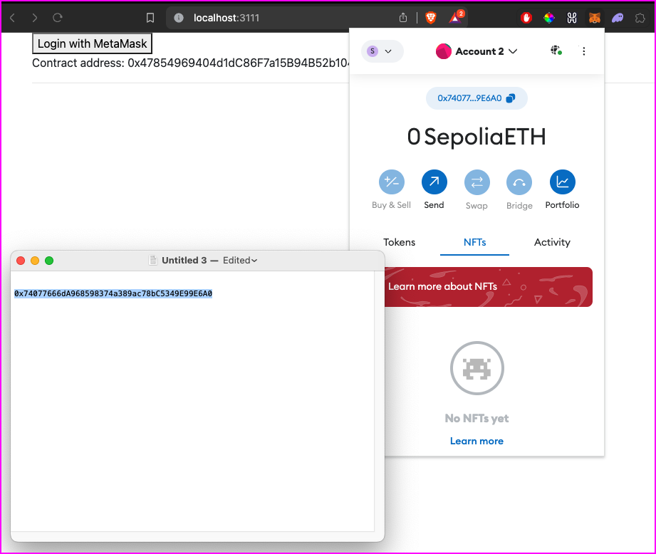
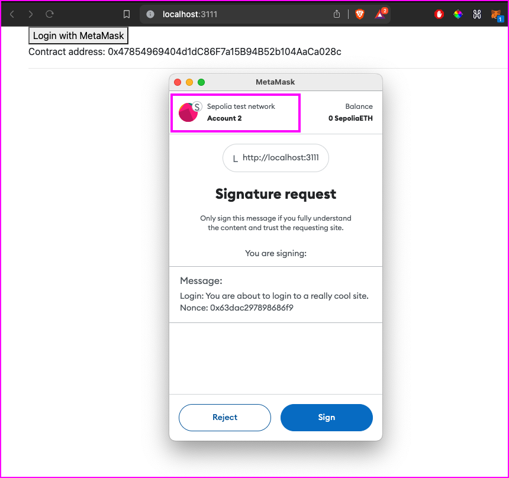
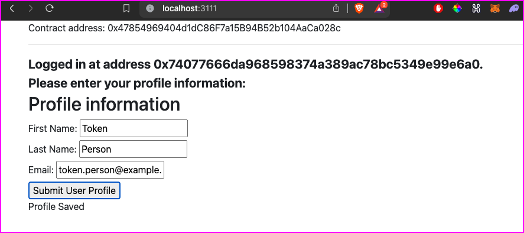
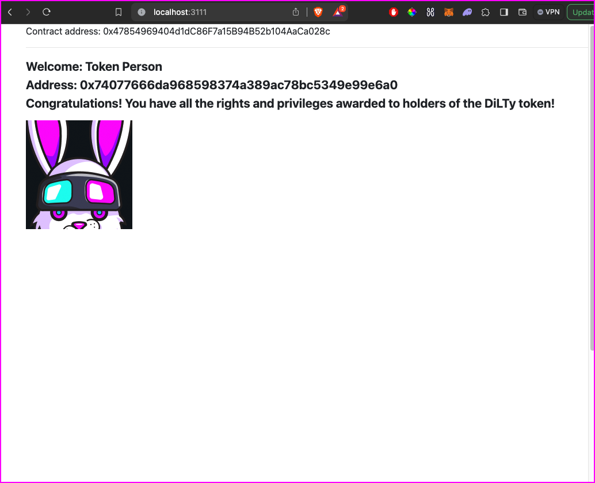

# Using the Token Gating Demonstration Website

|For demonstration use only|
|---|
|Be advised that the code in this repository is intended for demonstration purposes only.  It is not intended for use in a production environment.  The code is provided as-is and the author is not responsible for any damages that may result from its use.  The code is provided under the MIT license.|

The purpose of the demonstration website is to show how to use the Dilty smart contract to gate access to a website.  The website is a simple Node.JS application that uses the Express framework.  The website is designed to gate access to a page that displays a list of NFTs.  The website interacts the Dilty smart contract to gate access to the page.

In order get this site up and running, first you must execute the tasks in the [hardhat directory](../hardhat) to upload the graphic associated with the gating NFT to IPFS and then compile and deploy the smart contract to the testnet.  Also, you'll run a script that will actually mint the gating NFT and transfer it to the address of the person being gated.

Once tasks in the [hardhat directory](../hardhat) are complete, you can run the web server to see the demonstration website in action.

Also, be advised the before you can run the website you must have a `.env` file in the root of the website directory.  The `.env` file should contain the following:

```env
INFURA_API_KEY=<Infura key here> // used to access the Seoplia testnet
SEPOLIA_PRIVATE_KEY=<Sepolia private key here> // This is the private key of the account that will deploy the smart contract
ADMIN_PRIVATE_KEY==<Admin private key here> // This is the private key of the account that will deploy the smart contract
PINATA_API_KEY=<Pinata API key here>
PINATA_SECRET_API_KEY=<Pinata secret here>
```

# Getting the demonstration website up and running

In the root of the website directory, run the following command to install the necessary packages:

```bash
npm install
```

To start the web server, run the following command:

```bash
npm start
```

# Using the demonstration website

**IMPORTANT:** In order to get this demonstration website to work you must have created the smart contract that manages NFT minting. You do this by following the process described in the [hardhat directory](../hardhat).

Also, this demonstration website requires that you have MetaMask installed in your browser and that MetaMask in bound to at least two different user addresses. Also, MetaMask must be bound to the Sepolia testnet. In addition, the `.env` file must be created and configured as described above.

If these conditions are not met, the demonstration website will not work. However, if these conditions are met, you can get use the website by following the steps below.

---

**Step 1:**  Navigate to the website in your browser.  The website is located at `http://localhost:3111`.

**Step 2:**  Go to MetaMask and switch to the first of the addresses on Sepolia.


**Step 3:**  Go back to the webpage a click the "Login with MetaMask" button.  This will cause MetaMask to prompt you to sign a message.  Click "Sign" to sign the message.


**Step 4:**  Once you've logged in the web page will display a user profile form.


**Step 5:** Fill out the form and click "Submit User Profile".


**Step 6:** Refresh the web page and log in again using the same address with MetaMask.



**Step 7:** The user's name information and user address will be displayed on the web page.


**Step 8:** Take note of the second address in MetaMask.  This is the address that will be gated.



**Step 9:** To back to the first address in MetaMask.


**Step 11:** Go to the Admin webpage on the website at `http://localhost:3111/admin` and enter the Admin Password, `admin123` (1).
The token gating form will be displayed.  Enter the address of the user to be gated (2) which is the second user address. Then click "Create Gating Token" button (3).



**Step 12:** A confirmation message will appear at the bottom of the form.


**Step 13:** Change the second address in MetaMask which is the address of the user that has been gated.



**Step 14:** Refresh the web page to `http://localhost:3111/` and log in using MetaMask with the second user address that has been gated.  



**Step 15:** Fill in the profile form for the second user address and click "Submit User Profile".


**Step 16:** A confirmation message will appear at the bottom of the form.



**Step 17:** Refresh the web page to `http://localhost:3111/` and log in using MetaMask with the second user address that has been gated.


**Step 18:** The gating token will be displayed on the web page. Right now the only special behavior is that the gating token is displayed.  In the future, the gating token will be used to provide special permissions to the user.


